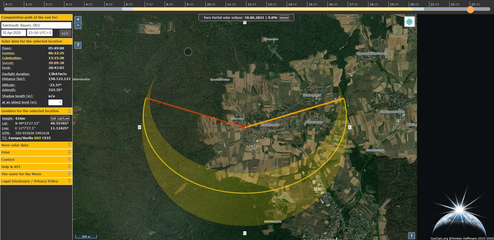
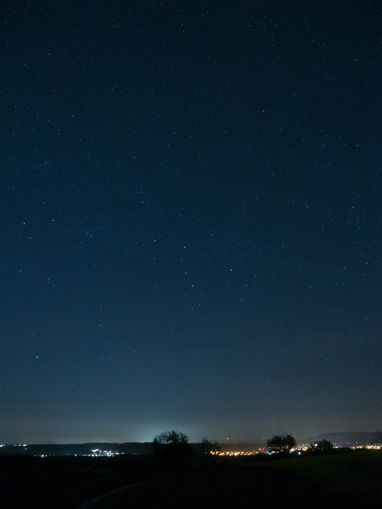
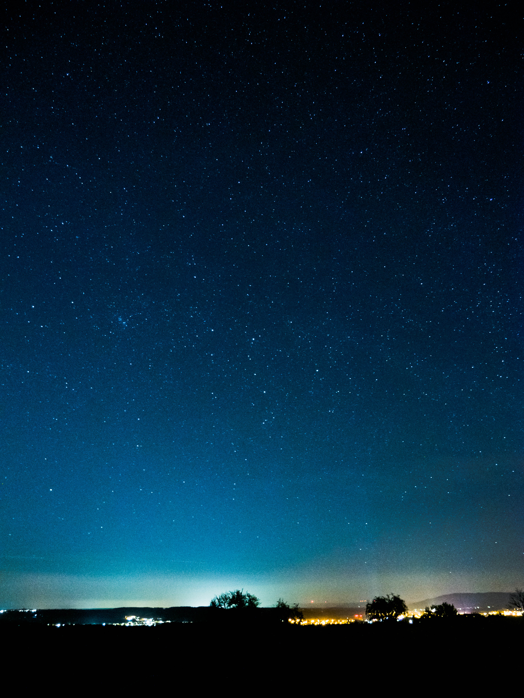

# Startrail Photography near Kalchreuth
## Planning
I knew this is a nice spot, so I only had to check when the sun sets and where exactly north is.


## Expose
Start at 23:00, finnish at 23:55 MESZ

```Lumix G Vario 14-140 on Panasonic Lumix G70, 128 Images, 17mm, ISO 1600, 25s at f 3,7```



## Edit
with Lightroom



then export all images in new folder

## Startrail image
with StarStaX
import all images
render ("lighten up", "comet mode activated")
export image


## Timelapse
render in StarStaX ("lighten up", "comet mode activated", "save every step [in new folder]")

use FFMPEG to render the video
```
-r: Framerate
[-start_number X]
-i input files (S__00000%03d.jpg ->S__00000XXX.jpg 
-vf iw/1:ih/1 -> full size, iw/2:ih/2 -> half size etc.


ffmpeg -r 10  -i S__00000%03d.jpg  -vcodec libx264 -vf scale="iw/1:ih/1"  comet.mp4 
```

### Youtube Video (additive timelapse ❤️)
[Youtube Video](https://www.youtube.com/embed/b7orlhs05yo)

## Links
[StarStaX](https://markus-enzweiler.de/software/starstax/)

[SunCalc](https://www.suncalc.org/#/49.5576,11.1243,14/2020.04.15/02:00/1/1)

